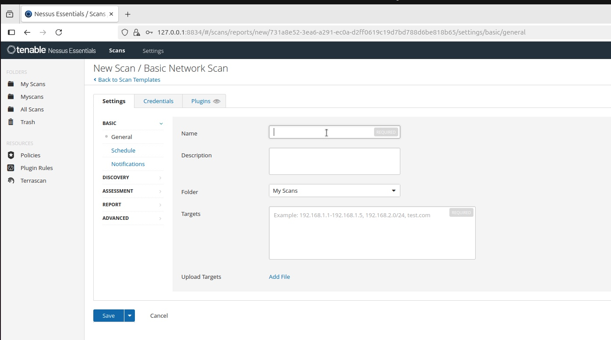
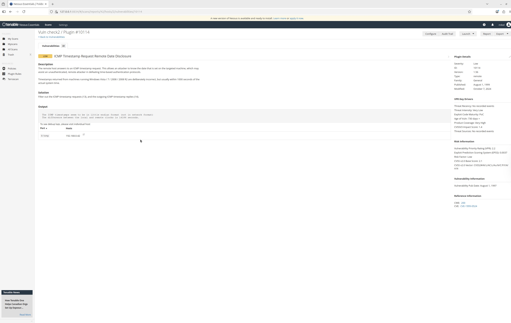
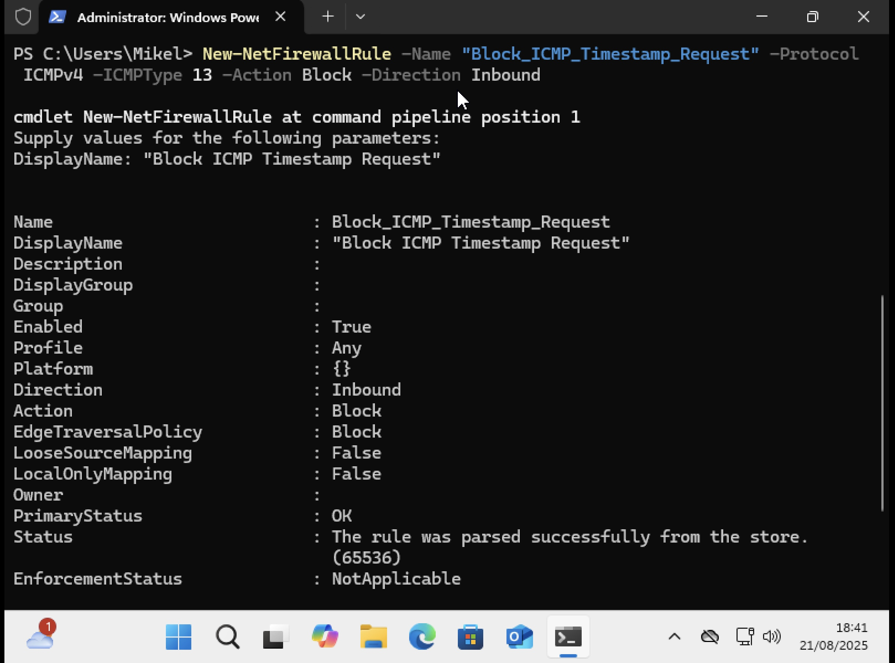
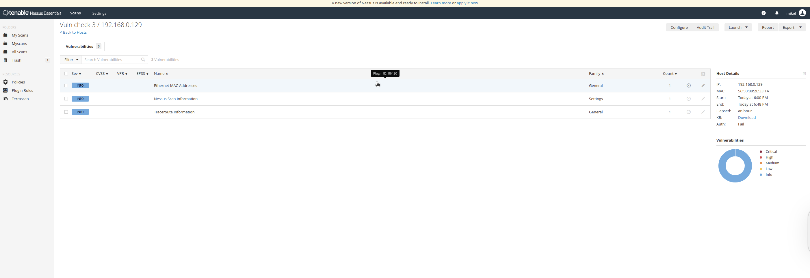

# VULNERABILITY CHECK WITH NESSUS

Nessus provides a vulnerablity scan on a larger scale. With credential scans, it logins into your target machine and performs a thourough vulnerability scan to detect security risks. The risks found is then rated via a pie chart with severity ratings including critical, high, medium/low. Below is a step-by-step approach on how to run Nessus to detect vulneraibities in your Windows VM.

**Target:** Windows VM (192.168.xxx.xxx)

**Tool Used:** Nessus

**APPROACH:**

- A new scan was configured in Nessus, with the target set to the IP address of the Windows VM (192.168.xxx.xxx).

- Within the configuration, authentication credentials (username and password of the Windows VM) were provided under the **Credential** section. This allowed Nessus to log in to the machine and perform an in-depth credentialed scan rather than a surface-level network scan.

.jpeg)

- The scan was launched and executed. Due to the nature of credentialed scans, the process required additional time to complete. Upon completion, the scan status was marked as **Completed** in the Nessus interface.
- Following the execution, the results were reviewed within the **Vulnerabilities** section. The findings were categorized by severity levels, ranging from **Critical** to **High**, **Medium**, and **Low**. A pie chart representation provided a distribution of vulnerabilities based on their severity.

**Findings**

The scan identified a risk named ICMP Timestamp Request Date Disclosure.

After reading the description and further research of what the problem was, it was concluded that the target machine (Windows VM) responds to ICMP timestamps upon query. This shows the current time value, which may allow an attacker to interfere with system clock systems. Even though this pose a low risks, it provides **reconnaissance value** for attackers, aiding further exploitation

**Resolution.**

This can be fixed by disabling ICMP replies. The Windows Defender Firewall ws configured  so that it doesn’t respond to these ICMP requests.

This was done through the Windows Powershell terminal:

---

**Verification**

For verification, a second vulnerability check was initiated and the result was none. The ICMP timestamp threat was eradicated. 

**Conclusion**

The Nessus credentialed vulnerability scan successfully identified security risks within the Windows VM. The severity-based classification allowed for prioritization of remediation efforts, ensuring that critical and high-severity issues were addressed first. This exercise demonstrated the effectiveness of Nessus in detecting and categorizing vulnerabilities when proper authentication credentials are provided.
