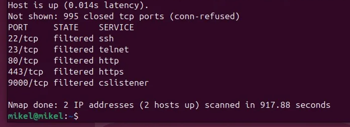
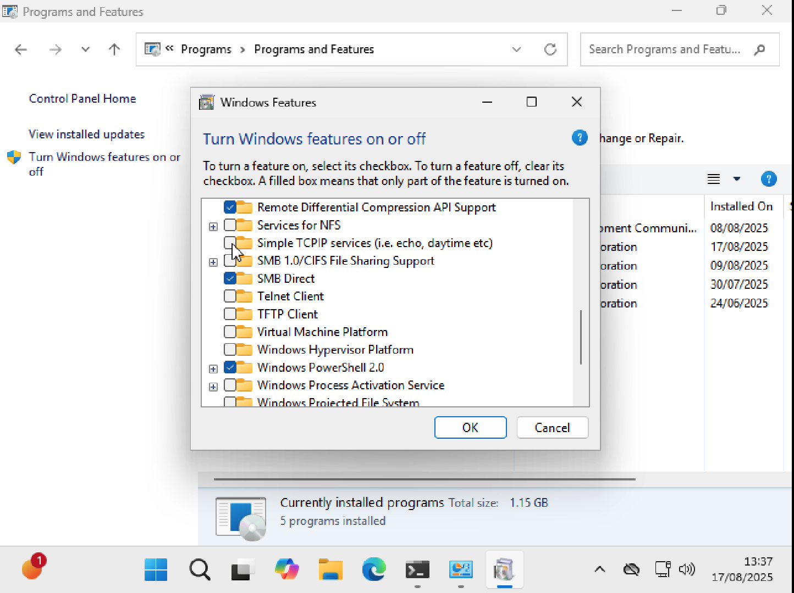
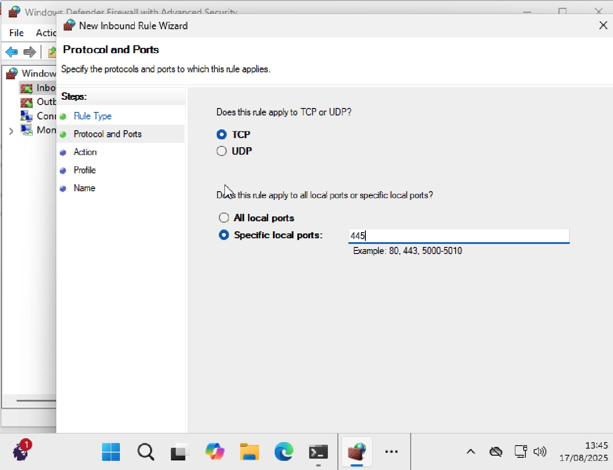
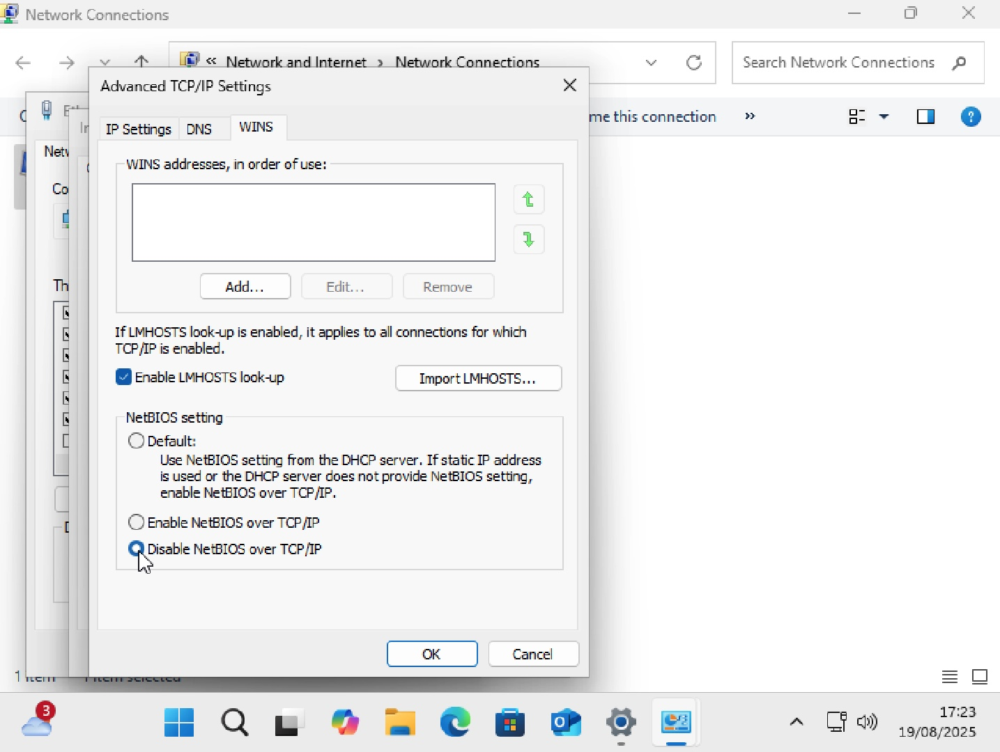
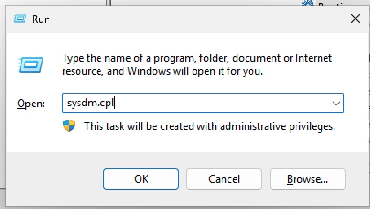

# VULNERABILTY CHECK WITH NMAP

**Port Scanning with NMAP**

In this exercise, the Linux virtual machine (VM) serves as the scanning host, while the Windows VM acts as the target system. The objective is to identify open ports on the Windows VM to assess potential vulnerabilities.

Prior to scanning, the firewall on the Windows VM was temporarily disabled to allow accurate detection of open ports.

```powershell
Set-NetFirewallProfile -Profile Domain,Public,Private -Enabled False
```

**Target:** Windows VM (192.168.xxx.xxx)

**Tool Used:** Nmap

**Command :**

The following command was run to identify open ports:

```bash
sudo nmap -sT 192.168.xxx.xx  #scans for ports

```


**Findings:**

- Port 135 (RPC Endpoint Mapper) : Open
- Port 139 (NETBIOS) : Open
- Port 445 (SMB) : Open

Subsequently, additional scans were conducted against the system’s public IP address to verify whether these ports were exposed to the internet. Port 135 appeared in an ignored or filtered state, suggesting that it was blocked by the firewall and not externally accessible. This confirmed that the isolated lab configuration prevented exposure of these services to the outside network.

```bash
nmap -p 445 your.public.ip.address
nmap -p 135 your.public.ip.address
nmap -p 135 your.public.ip.address
```



**Risk of Open Ports:**

Even in isolated environments, the presence of open ports poses risks if exploited by an attacker with local access.

- **Port 135 (RPC):** Can be abused for privilege escalation, lateral movement, or remote code execution.
- **Port 139 (NetBIOS):** Exposes the machine’s NetBIOS name, shared resources, and user information.
- **Port 445 (SMB):** A common attack vector for ransomware campaigns and credential theft within enterprise networks.

**Solution:**

Since these ports contribute to core Windows functionality, they cannot be fully disabled without impacting system operations. However, their attack surface can be reduced by hardening configurations and restricting unnecessary access.

**Port 445**

**Disabling SMBv1**

The outdated SMBv1 protocol should be disabled while keeping SMBv2 and SMBv3 enabled. This can be achieved through the Windows Features panel by deselecting “SMB 1.0/CIFS File Sharing Support” and restarting the system.



**Block SMB Ports with Firewall**

Inbound firewall rules can be configured to block traffic on TCP port 445 across Domain, Private, and Public profiles, thereby reducing external exposure without fully disabling SMB services.



**Port 139 (NetBIOS)**

**Disabling NetBIOS**

The NetBIOS service can be disabled through the network adapter’s advanced settings under the WINS configuration.

- Control Panel > Network & Internet > Network and Sharing Centre
- In the “Change adapter settings” > NIC > Properties> Internet Protocol Version 4 (TCP/IPv4)
- In Advanced > WINS > Disable NetBIOS over TCP/IP



**Blocking NetBIOS port with Firewall**

- An inbound firewall rule can be applied to block TCP port 139, further restricting access to this service.

**Port 135 (RPC)**

**Disabling RPC**

- Core RPC functionality should be retained, but services such as *Remote Registry* and *Routing and Remote Access* can be disabled via the Services console if not required.


Additionally, system properties can be configured to disallow remote connections.




## **Conclusion**

The port scanning process confirmed that the Windows VM exposed several critical ports (135, 139, and 445) within the isolated lab network. While these services were not exposed to the internet, they represent potential attack surfaces for local adversaries. By disabling outdated protocols (e.g., SMBv1), restricting unnecessary services (e.g., NetBIOS), and applying targeted firewall rules, the system’s attack surface can be significantly reduced without compromising core functionality.

---
